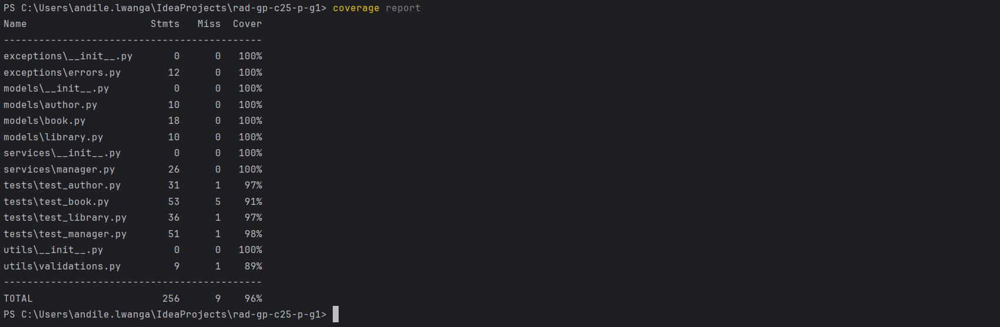

# [RaD-GP-C25-P-G1] Python - Building a Library Management System using Python and Object-Oriented Programming

## Overview

This is a command-line-based **Library Management System** developed in **Python 3.12**. Built over the course of **4 weeks** as part of Clickatell's Graduate R&D coursework project, this system simulates a digital library environment with functionality to **add, search, borrow, return, and remove books**. It serves as a practical application of object-oriented programming (OOP), modular software architecture, and test-driven development.

---

## Project Features

- Add new books with title, author, and ISBN
- Borrow and return books (updates availability)
- Remove books by ISBN
- Search books by title or author keyword
- View all books in the library
- Persistent storage using JSON
- Custom error handling (e.g., `BookNotFoundError`)
- Unit testing with `unittest` framework

---

## Class Design

| **Class Name**              | **Responsibility / Description**                                                                                                                                      |
|----------------------------|------------------------------------------------------------------------------------------------------------------------------------------------------------------------|
| `Book`                     | Represents a book entity with `title`, `author`, `ISBN`, and `availability` status. Supports serialization to/from JSON via `to_dict()` and `from_dict()`.          |
| `Author`                   | Represents an author with a `name` and a list of their `books`. Provides a method to `add_book()` and a readable string format.                                       |
| `Library`                  | Manages a collection of books. Supports operations to `add`, `find`, and `list` all books. Acts as an in-memory database.                                             |
| `manager` (module)         | Contains business logic for library operations: `add_book`, `borrow_book`, `return_book`, `search_books`, and `remove_book`. Enforces rules and raises exceptions.   |
| `storage` (module)         | Handles loading and saving books to a JSON file. Abstracts away persistence logic using `load_books()` and `save_books()`.                                            |
| `cli` (module)             | Provides a command-line interface for interacting with the library. Displays a menu, handles user input, and calls manager functions.                                |
| `BookNotFoundError`        | Custom exception raised when an ISBN does not match any book in the library.                                                                                          |
| `BookAlreadyBorrowedError` | Raised when attempting to borrow a book that is already checked out.                                                                                                   |
| `InvalidISBNError`         | Raised when the ISBN format does not meet validation criteria (13 or 15 digits, numeric only).                                                                         |
| `validations` (utils)      | Utility module for input validation, e.g. checking non-empty strings and valid ISBN format. Promotes code reuse and clean error handling.                              |


## File Structure

```bash
rad-gp-c25-p-g1/
├── .idea/
├── data/
│   └── data.json
├── exceptions/
│   ├── __init__.py
│   └── errors.py
├── interface/
│   ├── __init__.py
│   └── cli.py
├── utils/
│   ├── __init__.py
│   └── valildations.py
├── models/
│   ├── __init__.py
│   ├── author.py
│   ├── book.py
│   └── library.py
├── services/
│   ├── __init__.py
│   ├── manager.py
│   └── storage.py
├── tests/
│   ├── __init__.py
│   ├── test_author.py
│   ├── test_book.py
│   ├── test_library.py
│   ├── test_manager.py
│   └── images/
│       └── Coverage_Report.png
├── main.py
└── README.md


```

---

## How to Run

1. Ensure Python 3.12+ is installed.
2. Open a terminal and navigate to the root project folder.
3. Run the application:

```bash
python main.py
```

4. Follow the numbered menu to interact with the library system.

---

## Running Unit Tests

Unit tests are written using Python’s built-in `unittest` module.

To run all tests:

```bash
python -m unittest discover tests
```

For test coverage (optional):

```bash
coverage run -m unittest discover tests
coverage report
```

---

## Code Quality

- Follows **PEP 8** coding standards
- Uses **modular architecture** and the **Single Responsibility Principle**
- All files are organized with `__init__.py` to support import cleanliness
- Inline comments and docstrings used to improve maintainability

---

## Error Handling

Custom exceptions used to gracefully handle business logic failures:

- `BookNotFoundError` — raised when a book cannot be located by ISBN
- `BookAlreadyBorrowedError` — raised when a book is unavailable
- `InvalidISBNError` - raised when the ISBN number is incorrectly formatted

Handled in the CLI with meaningful, user-friendly messages.

---
## Coverage Report



